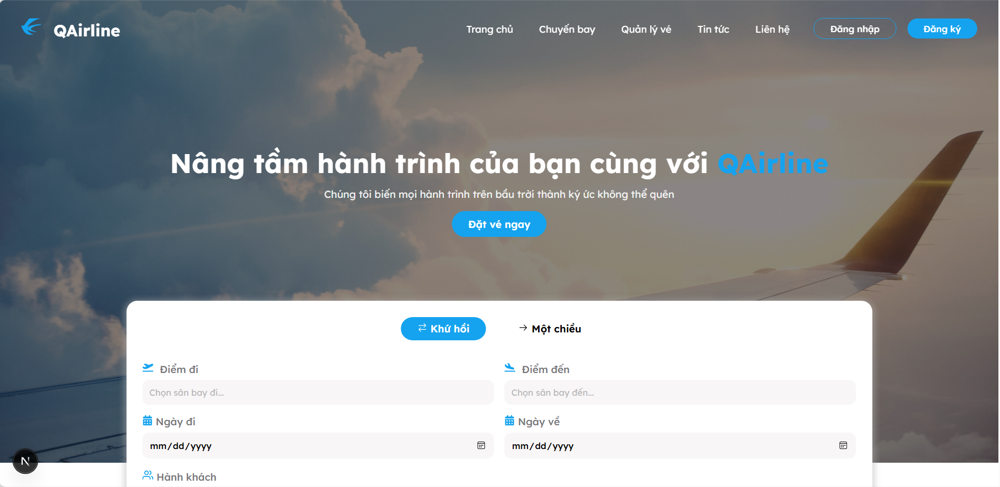

# QAirline - Trang Web Đặt Vé Máy Bay


Trang web đặt vé máy bay QAirline là một nền tảng trực tuyến giúp người dùng dễ dàng tìm kiếm, so sánh và đặt vé máy bay. Với giao diện thân thiện và các tính năng thông minh, trang web cung cấp trải nghiệm đặt vé nhanh chóng, tiện lợi và an toàn.

## Tính năng
- **Tìm kiếm chuyến bay**: Hỗ trợ tìm kiếm vé máy bay theo điểm đi, điểm đến, ngày bay và số lượng hành khách.
- **Đặt vé nhanh chóng**: Quy trình đặt vé đơn giản với hỗ trợ thanh toán trực tuyến.
- **Quản lý đặt vé**: Xem lại thông tin và trạng thái các đặt vé đã thực hiện.
- **Quản lý tài khoản**: Cập nhật thông tin cá nhân và xem lịch sử đặt vé.
- **Thanh toán an toàn**: Hỗ trợ nhiều phương thức thanh toán với bảo mật cao.

## Công nghệ sử dụng

### Frontend
- **Next.js 14**: Framework React hiện đại với SSR
- **TypeScript**: Đảm bảo type safety cho code
- **Redux Toolkit**: Quản lý state toàn cục
- **SCSS Modules**: Styling với CSS modules
- **Axios**: Xử lý HTTP requests

### Backend
- **Node.js**: Runtime environment
- **Express.js**: Web framework
- **JWT**: Xác thực và phân quyền

### Cơ sở dữ liệu
- **MySQL**: Database chính cho lưu trữ dữ liệu người dùng, chuyến bay và đặt vé

## Cài đặt và Chạy

### Yêu cầu
- Node.js (version 18.0.0 trở lên)
- npm hoặc yarn

### Cài đặt dependencies
```bash
npm install
# hoặc
yarn install
```

### Chạy development server
```bash
npm run dev
# hoặc
yarn dev
```
Ứng dụng sẽ chạy tại `http://localhost:3002`
